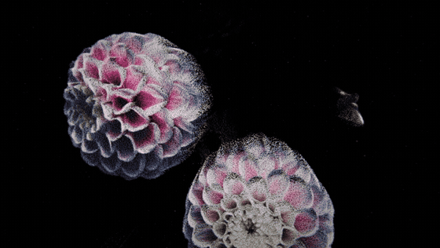
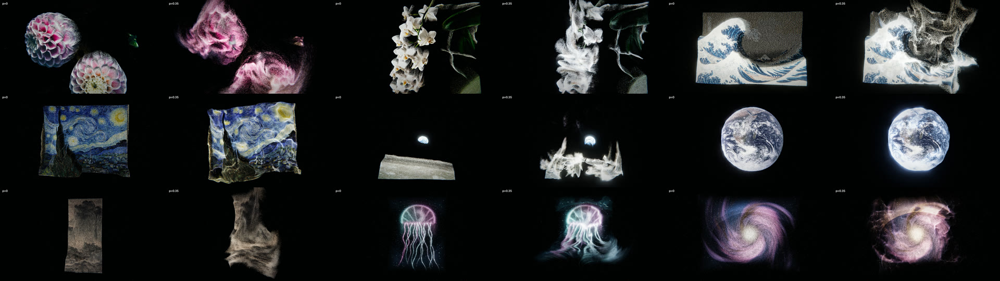

# Image Particle FX · 图片粒子特效

把任意一张图片变成电影感的 3D 粒子：画面沿流场碎散成光粒、翻卷飘散，再重组回原样。
浏览器里实时运行，拖动推子即可「打碟式」控制消散与重组。

**在线体验 →  https://8533502-dev.github.io/image-particle-fx/**



## 它能做什么

- **任意图片 → 立体点云**：浏览器内用 AI（Depth Anything V2）估计深度，自动区分主体与背景，按细节重要度采样粒子。
- **14 种精心设计的效果**：流体侵蚀、余烬升腾、风蚀流沙、奇点吞噬、超新星、星系旋臂、晶格碎裂、数据流瀑、磁流体、丝绸流线、共振涟漪、花瓣风、水墨晕散、A→B 重组变形。
- **电影级画面**：粒子沿无散度流场走弯曲轨迹、按速度方向拉伸的运动模糊、景深、HDR 热光消散边、ACES 色调映射、辉光与胶片颗粒。
- **可拖动、可回放**：粒子位置完全由进度决定，推子来回拖、时间轴可循环，离线导出逐帧一致。
- **网页里直接导出视频**：点右上角「导出视频」，在浏览器里逐帧渲染成 MP4（720p / 1080p / 竖屏 1080×1920 / 4K，30 或 60 fps，可只导出消散段），不掉帧、不用装任何软件。
- **三种产出**：可直接打开的作品网页、逐帧视频导出（网页内或命令行，命令行另支持 ProRes）、React / Vue 组件。



## 作为 Claude Code Skill 使用

这个仓库的 `skill/image-particle-fx/` 是一个 [Claude Code](https://claude.com/claude-code) Skill。安装后，给 Claude 一张图并说「把这张图做成粒子消散效果」，它会自动：看图做美术决策（效果、配色、运镜、节奏）→ 生成项目 → 渲染截图自查 → 交付网页 / 视频 / 组件。

**安装**（二选一）：

```bash
git clone https://github.com/8533502-dev/image-particle-fx.git
mkdir -p ~/.claude/skills && cp -R image-particle-fx/skill/image-particle-fx ~/.claude/skills/
```

或在 [Releases](https://github.com/8533502-dev/image-particle-fx/releases) 下载 `image-particle-fx.skill`，在 Claude 里点「Save skill」。

**对 Claude 说**，例如：

- 「把这张图做成粒子消散效果」
- 「用这张产品图做一个粒子爆散的视频，1080p 竖屏」
- 「这两张图做一个 A 碎散重组成 B 的过渡」
- 「给官网首屏做一个粒子图片组件，滚动时消散」

## 不用 Claude，直接用脚本

需要 Node 18+、Chrome（或 Edge / Chromium）、ffmpeg（导出视频时）。

```bash
S=skill/image-particle-fx
node $S/scripts/scaffold.mjs ./my-fx --image ~/Pictures/photo.jpg   # 建项目（--preset 用内置示例，--list-presets 查看）
node $S/scripts/serve.mjs ./my-fx                                   # 本地预览，打开打印出的地址
node $S/scripts/check.mjs --dir ./my-fx --effects all               # 生成这张图所有效果的对比图
node $S/scripts/export.mjs --dir ./my-fx --w 1920 --h 1080 --fps 60 # 导出视频（竖屏 --w 1080 --h 1920，4K --w 3840 --h 2160）
```

场景配置格式见 `skill/image-particle-fx/references/scene-format.md`，效果说明与选图建议见 `references/effects.md`，引擎原理与扩展见 `references/engine.md`。

### 网页操作

| 操作 | 方法 |
|---|---|
| 消散 / 重组 | 拖底部推子（空格播放 / 暂停） |
| 切换效果 | 左侧列表，或数字键 1–9 |
| 换图 | 右上角「打开图片」，或把图片拖进页面 |
| 内置示例 | 右上角「示例图」 |
| 视角 | 拖拽旋转、滚轮缩放、双击复位 |
| 调参 | 右上角「调参」 |
| 导出视频 | 右上角「导出视频」，选尺寸 / 帧率 / 范围后开始，完成自动下载 MP4 |
| 录屏 | 按 H 隐藏界面 |

## 网站里使用组件

把 `skill/image-particle-fx/assets/fx/` 复制进项目（如 `src/fx/`），`npm i three`，然后使用
`assets/components/ParticleImage.jsx`（React）或 `ParticleImage.vue`（Vue 3）：

```jsx
<ParticleImage src="/hero.jpg" effect="silk" progress={scrollProgress} style={{ height: '100vh' }} />
```

## 素材与授权

- 代码：[MIT](LICENSE)。内含 Ashima Arts / Stefan Gustavson 的 simplex noise（MIT）。运行时从 jsDelivr 加载 three.js（MIT）与 transformers.js（Apache-2.0）。
- 内置预设图片均为**公有领域**、**CC0** 或为本项目原创，出处见 [`CREDITS.md`](skill/image-particle-fx/assets/presets/CREDITS.md)。
- 你用自己的图片制作的作品，图片版权由你自行负责。

---

**English** — Turn any image into a cinematic 3D particle piece in the browser: AI depth (Depth Anything V2), 14 hand-tuned
dissolve/reassemble effects driven by divergence-free flow fields, per-particle motion blur, DOF and HDR glow, a DJ-style fader,
frame-exact offline video export, and React/Vue components. Ships as a Claude Code skill (`skill/image-particle-fx`) plus a
static web app (`docs/`, live at https://8533502-dev.github.io/image-particle-fx/). Code is MIT; bundled preset images are
public domain or CC0.
